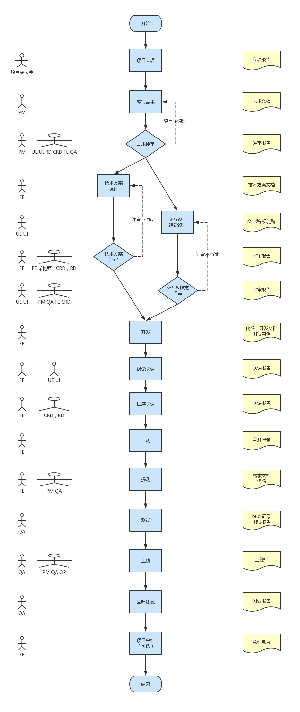

## 简答题
### 1、谈谈你对工程化的初步认识，结合你之前遇到过的问题说出三个以上工程化能够解决问题或者带来的价值。
给人以为前端工程化是一个很宏大的话题，前端项目早已不是一个简单的页面，随着前端项目的日益庞大，前端工程化必然的。
借鉴维基百科对项目工程的定义：
关于软件工程的定义，在GB/T11457-2006《信息技术 软件工程术语》中将其定义为"应用计算机科学理论和技术以及工程管理原则和方法，按预算和进度，实现满足用户要求的软件产品的定义、开发、和维护的工程或进行研究的学科"。
包括：
- 创立与使用健全的工程原则，以便经济地获得可靠且高效率的软件。
- 应用系统化，遵从原则，可被计量的方法来发展、操作及维护软件；也就是把工程应用到软件上。
- 与开发、管理及更新软件产品有关的理论、方法及工具。
- 一种知识或学科，目标是生产质量良好、准时交货、符合预算，并满足用户所需的软件。
- 实际应用科学知识在设计、建构计算机程序，与相伴而来所产生的文件，以及后续的操作和维护上。
- 使用与系统化生产和维护软件产品有关之技术与管理的知识，使软件开发与修改可在有限的时间与费用下进行。
- 建造由工程师团队所开发之大型软件系统有关的知识学科。
- 对软件分析、设计、实施及维护的一种系统化方法。
- 系统化地应用工具和技术于开发以计算机为主的应用。
- 软件工程是关于设计和开发优质软件。

前端工程也属于软件工程中的一种，同样我们需要考虑以上相关的问题。
nodejs给前端工程带来来革命性的变更。
#### 1. 可以从编译构建去理解前端工程
编译是指将源代码变为目标代码的过程，从源代码的语言转变为另外一种计算机语言（一般为比源代码语言更为底层的语言）。
构建是指一些列的处理，包括编译。不同的语言构建会有不通的处理步骤，最终产生可在具体特性环境运行的Artifact。

前端的编译。为了更好的编程体验和更高的可维护性，会使用一些超集的语言，然后再转译为浏览器可以运行的语言。例如对 es5/6/7 等语法的转译为对应环境支持的代码；less、sass 等转译为 css；typescript、coffeescript 等转译 javascript 。

前端构建过程一般包括以下几个过程：

- 代码检查å
- 运行单元测试等
- 语言编译
- 依赖分析、打包、替换等
- 代码压缩、spirit 图片压缩等
- 版本生成

构建结果一般生成为一个或多个文件，里面包括直接可以在部署在特定环境中的所有内容。

#### 2. 也可以从模块化、组件化、规范化、自动化方向去理解
2.1 模块化
将一个复杂的程序依据一定的规则(规范)封装成几个块(文件), 并进行组合在一起
块的内部数据与实现是私有的, 只是向外部暴露一些接口(方法)与外部其它模块通信
- 避免命名冲突(减少命名空间污染)
- 更好的分离, 按需加载
- 更高复用性
- 高可维护性

- CommonJS规范主要用于服务端编程，加载模块是同步的，这并不适合在浏览器环境，因为同步意味着阻塞加载，浏览器资源是异步加载的，因此有了AMD CMD解决方案。
- AMD规范在浏览器环境中异步加载模块，而且可以并行加载多个模块。不过，AMD规范开发成本高，代码的阅读和书写比较困难，模块定义方式的语义不顺畅。
- CMD规范与AMD规范很相似，都用于浏览器编程，依赖就近，延迟执行，可以很容易在Node.js中运行。不过，依赖SPM 打包，模块的加载逻辑偏重
- ES6 在语言标准的层面上，实现了模块功能，而且实现得相当简单，完全可以取代 CommonJS 和 AMD 规范，成为浏览器和服务器通用的模块解决方案。

2.2 组件化

- 页面上的每个独立的可视/可交互区域视为一个组件；
- 每个组件对应一个工程目录，组件所需的各种资源都在这个目录下就近维护；
- 由于组件具有独立性，因此组件与组件之间可以 自由组合；
- 页面只不过是组件的容器，负责组合组件形成功能完整的界面；
- 当不需要某个组件，或者想要替换组件时，可以整个目录删除/替换。

2.3 规范化
- 文档规范
- 编码规范，包括html、css、js
- git仓库管理，提交命名规范
- 视觉规范
- 前后端接口规范
- 图片规范，尺寸大小，雪碧图等
- 目录结构制定
- 测试用例规范

2.4 自动化
前端工程化的很多脏活累活都应该交给自动化工具来完成
- 自动化构建
- 自动化部署
- 自动化测试

#### 3. 按项目层面理解
看图

### 2、你认为脚手架除了为我们创建项目结构，还有什么更深的意义？
- 提升团队工作效率
- 一句指令搞定基础代码，不用复制粘贴
- 编码更规范，还有一定约束能力
- 打包轻松
- 开发便捷
- 发布迅猛
- 还能搞点单元测试
- 启个服务做数据 mock 也未尝不可
- 比如 nrwl，多项目可以只依赖同一份 node_module, 公用多个lib库，lazy库等，angualr-cli的升级版 
- 还能为所欲为，有 node.js

